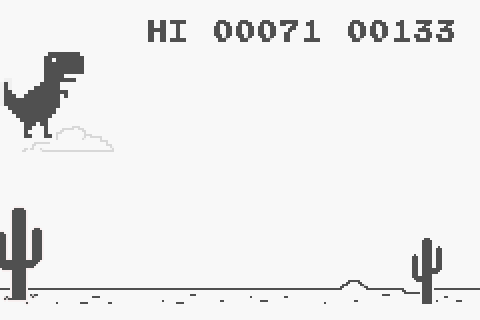
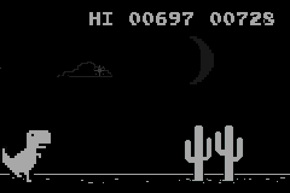

 

# Google-Dino-GBA
Google Dino Advance is a recreation of the Chromium Dino game for Nintendo's 2001 handheld: the Game Boy Advance.

# Playing
The ROM can be downloaded from the releases section. It can be opened in any Game Boy Advance emulator of your choosing, or a flash cart.  

- Up on the D-pad and the A button make Dino jump, down on the D-pad crouches or speeds up Dino's fall.
- Local Co-Op
  - Hold L+R on the `No Internet` screen for five seconds to launch a Co-Op session.
    - Player One controls Dino using the D-Pad
    - Player Two controls Mr. Dino using the face buttons.
    - Revive system: Grab the meat to revive your partner!
- Alternate Palettes
  - Hold down a key combination while the game is booting for alternate colors from the GBC backwards compatibility.
  - List available here:
    - https://gbstudiocentral.com/tips/game-boy-color-modes/

# Building
You can build a rom of your own with the CMake presets. Requires [devkitPro](https://devkitpro.org/wiki/Getting_Started)

# Notes
Referenced the original [chromium source](https://source.chromium.org/chromium/chromium/src/+/master:components/neterror/resources/offline.js;l=7?q=t-rex%20package:%5Echromium$&ss=chromium) heavily.
Game has been balanced to run as the actual game plays in a 240p sized window. The max speed was scaled down the same way the starting speed is scaled down in the original game.
All game art is property of Google :)
